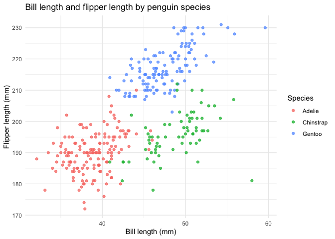

P8105 Homework 1
================
Zheming Bao

## Problem 1

``` r
data("penguins", package = "palmerpenguins")
```

The `penguins` dataset contains measurements of penguins from the Palmer
Archipelago in Antarctica. It has 344 rows and 8 columns, with one
penguin per row. The species are Adelie, Chinstrap, Gentoo, and the
islands are Biscoe, Dream, Torgersen. Measurements include bill length
and depth (mm), flipper length (mm), and body mass (g). The dataset also
records sex (female or male, with some missing values) and year
(2007–2009).

The mean flipper length is 200.92 mm. This calculation excludes 2
missing flipper-length measurements, using the remaining 342
observations.

``` r
penguin_plot = ggplot(
  penguins,
  aes(x = bill_length_mm, y = flipper_length_mm, color = species)
) +
  geom_point(alpha = 0.75, na.rm = TRUE) +
  labs(
    title = "Bill length and flipper length by penguin species",
    x = "Bill length (mm)",
    y = "Flipper length (mm)",
    color = "Species"
  ) +
  theme_minimal()

penguin_plot
```

<!-- -->

``` r
ggsave(
  filename = "penguin_scatterplot.png",
  plot = penguin_plot,
  width = 7,
  height = 5,
  units = "in",
  dpi = 300
)
```

Each point represents a penguin, with species mapped to color. Species
is a factor, so the colors form discrete groups. Bill and flipper
lengths are numeric, so both axes are continuous. Gentoo penguins
generally have longer flippers than the other two species. The plot
omits rows with missing coordinates and is saved as
`penguin_scatterplot.png` in the project directory.

## Problem 2

``` r
set.seed(2367)

sample_data = data.frame(
  normal_sample = rnorm(10),
  character_value = letters[1:10],
  factor_value = factor(
    rep(c("low", "medium", "high"), length.out = 10),
    levels = c("low", "medium", "high")
  )
)

sample_data$positive = sample_data$normal_sample > 0
sample_data = sample_data[
  c("normal_sample", "positive", "character_value", "factor_value")
]

sample_data
```

    ##    normal_sample positive character_value factor_value
    ## 1     1.65943851     TRUE               a          low
    ## 2    -2.21519576    FALSE               b       medium
    ## 3    -0.30171028    FALSE               c         high
    ## 4     0.86093172     TRUE               d          low
    ## 5     0.97864712     TRUE               e       medium
    ## 6    -0.06884194    FALSE               f         high
    ## 7     0.88005810     TRUE               g          low
    ## 8     0.07888131     TRUE               h       medium
    ## 9    -0.98053199    FALSE               i         high
    ## 10   -0.25100143    FALSE               j          low

The data frame has ten rows and four columns: a sample from a standard
Normal distribution (mean 0 and standard deviation 1), a logical
indicator of whether each sampled value is greater than zero, ten
character values, and a factor with three levels. Setting a seed makes
the sample reproducible.

``` r
mean(sample_data$normal_sample)
```

    ## [1] 0.06406754

``` r
mean(sample_data$positive)
```

    ## [1] 0.5

``` r
mean(sample_data$character_value)
```

    ## Warning in mean.default(sample_data$character_value): argument is not numeric
    ## or logical: returning NA

    ## [1] NA

``` r
mean(sample_data$factor_value)
```

    ## Warning in mean.default(sample_data$factor_value): argument is not numeric or
    ## logical: returning NA

    ## [1] NA

The numeric mean is 0.064. The logical mean is 0.5, the proportion of
sampled values greater than zero: R treats `TRUE` as 1 and `FALSE` as 0
when taking this mean. The character and factor means both return `NA`
with warnings because `mean()` does not accept these variable types as
numeric measurements.

``` r
as.numeric(sample_data$positive)
as.numeric(sample_data$character_value)
as.numeric(sample_data$factor_value)
```

The logical values convert to 1 (`TRUE`) and 0 (`FALSE`), explaining why
their mean is a proportion. The character values here are letters rather
than numeric strings, so they convert to `NA` and normally produce a
warning. Numeric strings such as `"12"` could be converted, but these
letters cannot. Output and warnings are hidden in this chunk as
requested.

The factor converts to its internal level codes: `low` becomes 1,
`medium` becomes 2, and `high` becomes 3, according to the explicitly
specified level order. These codes identify categories; they do not
establish numerical distances between the categories. Although the
converted codes have a computable mean, it is not a meaningful average
of the original categories. Thus, having internal integer codes does not
make a factor a numeric measurement, and taking the mean of the original
factor returns `NA`.
